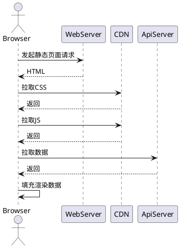
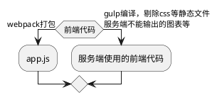
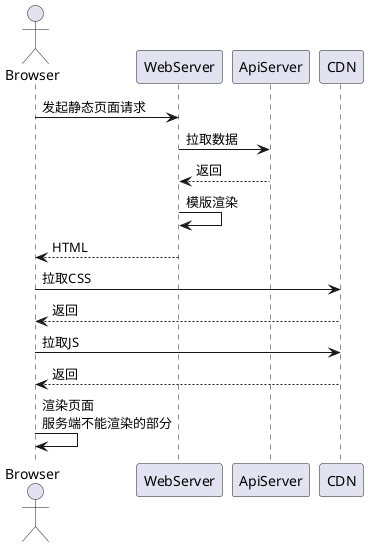

### [为什么要做服务端渲染？](#why)
### [怎么做？](#how)
### [存在的问题](#存在的问题)
### [参考资料](#参考资料)

---

#### why

1. 首页白屏 && 页面数据残缺

2. 不利于SEO

3. 请求历程

---

#### how
1. 代码复用

2. React同构
    - 路由同构，使用`match`函数匹配当前`url`需要用到的`Component`
    - 获取数据
    - 生成初始`Redux Store`
    - 使用`ReactDOMServer.renderToString`渲染为`HTML`字符串

3. 一些要注意的点
    - **`DOM`的一致性**：在前后端渲染相同的`Compponent`，将输出一致的`DOM`结构
    - **生命周期的差异**：在服务端上`Component`生命周期只会到 `componentWillMount`，客户端则是完整的
    - **客户端`render`时机**：同构时，服务端结合数据将`Component`渲染成完整的`HTML`字符串并将数据状态返回给客户端，客户端会判断是否可以直接使用或需要重新挂载
    
    - ...

4. 请求历程

考虑到模版最终渲染出来的文档的大小，如果CSS内容不是很大的话可以把CSS也内联到页面中，又可以减少一个请求。

5. 页面输出完整的`DOM`节点

---

#### 存在的问题
- 代码依然有冗余，比如请求接口的代码是可以做到复用的
- 对接口错误的处理
- 开发周期
- 其他...

---

#### 一些参考资料
[React koa2 同构应用实践](https://www.zeroling.com/react-koa2-isomorphic-practise/)
[Koa2 + React + Redux + antd 同构直出探索](https://juejin.im/entry/5837d016a22b9d006a74ff01)
[React同构直出优化总结](https://github.com/joeyguo/blog/issues/9)
