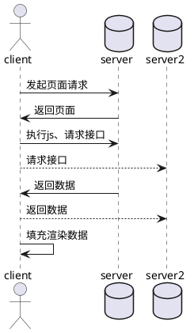
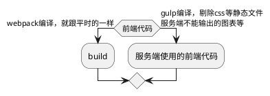
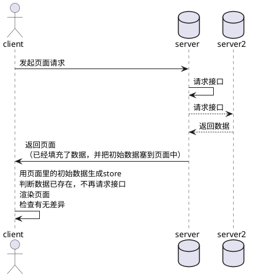

### [为什么要做服务端渲染？](#why)
### [怎么做？](#how)
### [存在的问题](#存在的问题)
### [参考资料](#参考资料)

---

#### why

- 首页白屏 && 页面数据残缺

- 不利于SEO

- 请求历程

---

#### how
- 路由同构
使用`match`函数匹配当前url需要用到的组件

- 代码复用

- 请求历程

- 页面里也不再只有那么几个js文件了

- 一些要注意的点
  1. 生命周期的差异
  2. ...

---

#### 存在的问题
- 代码依然有冗余，比如请求接口的代码是可以做到复用的
- 开发周期
- 其他...

---

#### 一些参考资料
[React koa2 同构应用实践](https://www.zeroling.com/react-koa2-isomorphic-practise/)
[Koa2 + React + Redux + antd 同构直出探索](https://juejin.im/entry/5837d016a22b9d006a74ff01)
[React同构直出优化总结](https://github.com/joeyguo/blog/issues/9)
